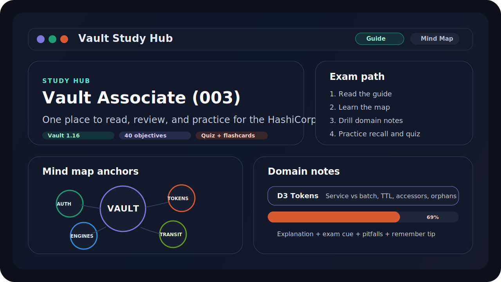
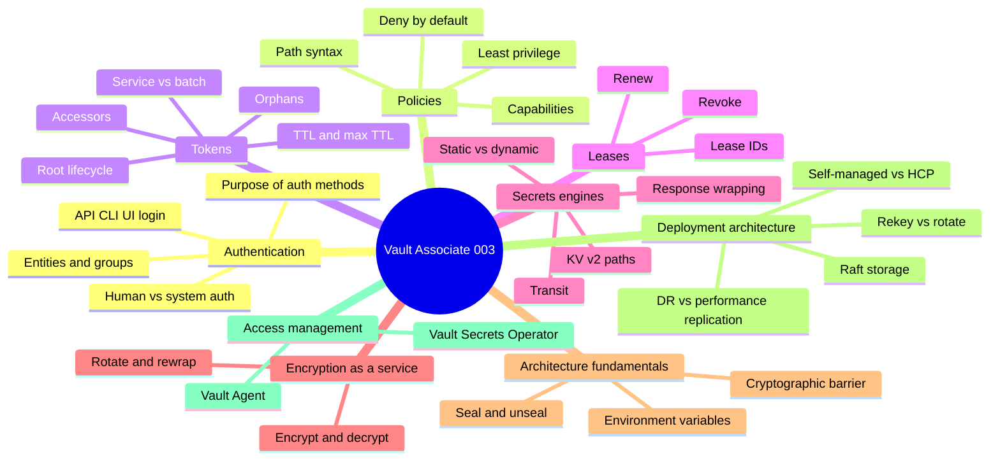

# Vault Associate Study Hub

An interactive study hub for the **HashiCorp Certified: Vault Associate (003)** exam.



This project is designed to be a single place to study:

- a guided reading view with explanations and exam traps
- an interactive mind map of the 9 domains
- per-domain deep notes for all 40 objectives
- flashcards, quiz mode, cheat sheet, and progress tracking

The current guide content is aligned to the official HashiCorp certification pages that list:

- **Exam:** Vault Associate (003)
- **Product version tested:** Vault 1.16
- **Format:** online proctored
- **Duration:** 1 hour
- **Planned live URL:** https://guilhermeafonsoch.github.io/vault-study-hub/

## What is inside

| View | Purpose |
|---|---|
| **Guide** | Read-first study guide with exam overview, domain explanations, common traps, and official links |
| **Mind Map** | Visual map of the exam domains and how the major concepts connect |
| **Grid** | Quick domain overview with progress bars |
| **Cheat Sheet** | Fast last-minute scan of every objective |
| **Flashcards** | Recall practice by domain or across the whole exam |
| **Quiz** | Multiple-choice practice with explanations |
| **Stats** | Progress tracking and readiness snapshot |

## Recommended study flow

1. Start in **Guide** and read the overall exam narrative.
2. Open the **Mind Map** until the domain relationships feel natural.
3. Study one domain at a time from the detailed notes.
4. Use **Flashcards** to force recall without looking.
5. Finish each session with **Quiz** mode.

## Exam mind map



## Run locally

```bash
cd vault-study-hub
npm install
npm run dev
```

Open [http://localhost:5173](http://localhost:5173).

### Production build

```bash
npm run build
npm run preview
```

## Project layout

```text
vault-study-hub/
├── README.md
├── index.html
├── package.json
└── src/
    ├── App.jsx
    ├── index.css
    ├── components/
    │   ├── DetailView.jsx
    │   ├── ObjCard.jsx
    │   ├── RadialMap.jsx
    │   ├── StudyGuide.jsx
    │   └── ...
    └── data/
        ├── domains.js
        ├── quiz.js
        └── studyGuide.js
```

## Official references

- [Vault Associate certification details](https://developer.hashicorp.com/certifications/security-automation)
- [Vault Associate (003) exam content list](https://developer.hashicorp.com/vault/tutorials/associate-cert-003/associate-review-003)
- [Vault Associate learning path](https://developer.hashicorp.com/vault/tutorials/associate-cert/associate-study)
- [Vault Associate sample questions](https://developer.hashicorp.com/vault/tutorials/associate-cert-003/associate-questions-003)
- [Vault 1.16 documentation](https://developer.hashicorp.com/vault/docs)

## Notes

- This is study material for exam preparation.
- It is not affiliated with or endorsed by HashiCorp.
